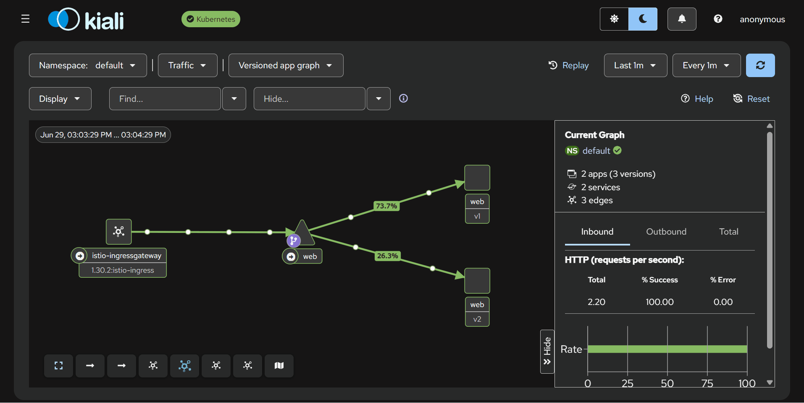
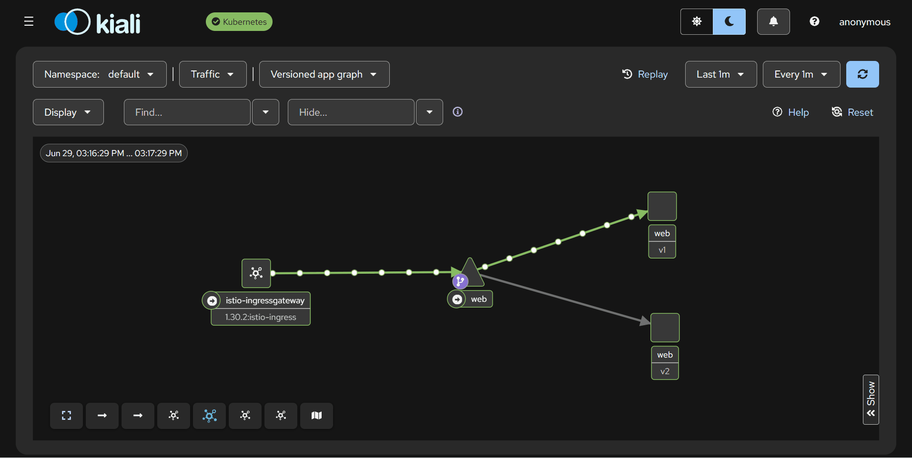
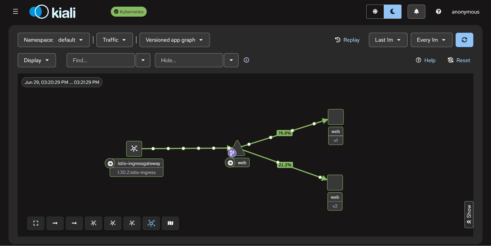
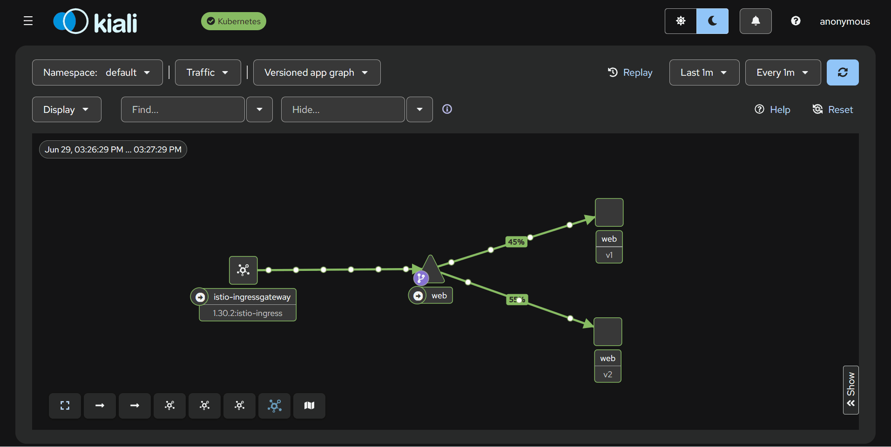
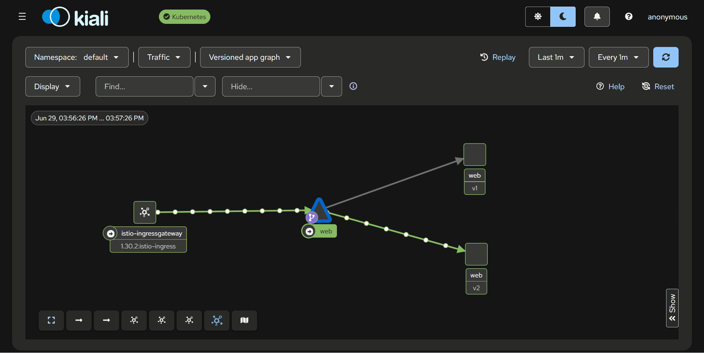
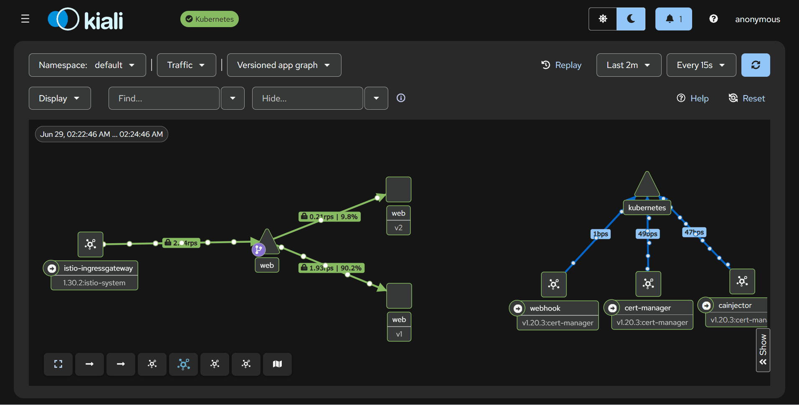
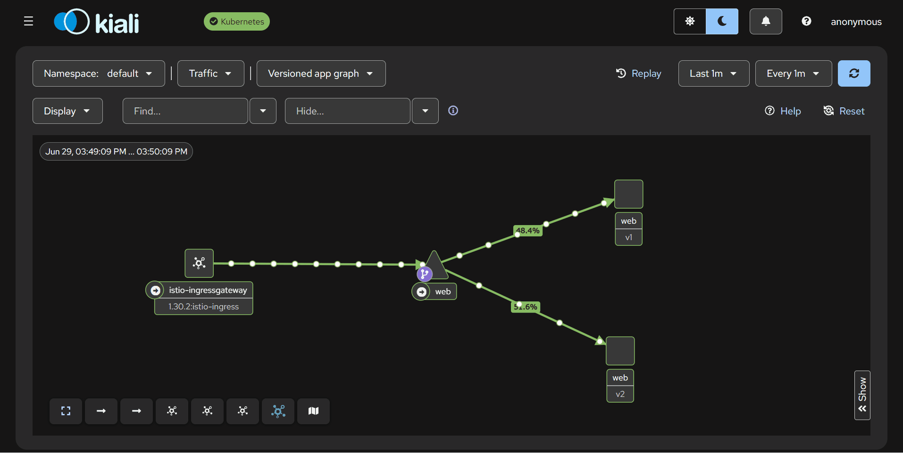

# Demo: Istio Key Features (Sidecar Mode)

A side project that explores Istio's key features on AKS: sidecar injection, ingress gateway, TLS termination, weighted load balancing, canary deployment, A/B testing, and traffic shadowing.

    

- [Demo: Istio Key Features (Sidecar Mode)](#demo-istio-key-features-sidecar-mode)
  - [Feature: Gateway API + sidecar injection](#feature-gateway-api--sidecar-injection)
  - [Feature: TLS security](#feature-tls-security)
  - [Feature: Load balancing](#feature-load-balancing)
  - [Feature: Canary deployment](#feature-canary-deployment)
  - [Feature: A/B testing](#feature-ab-testing)
  - [Feature: Shadowing](#feature-shadowing)
  - [Documentations](#documentations)

---

## Feature: Gateway API + sidecar injection

- **Sidecar injection**:
  - `Istio` automatically injects an `istio-proxy (Envoy)` container into every pod in a labeled namespace.
  - The proxy transparently intercepts all inbound and outbound traffic, enabling mTLS, routing, and telemetry without changing the application.
- **Ingress gateway**:
  - a dedicated Envoy deployment at the cluster edge that terminates external traffic and forwards it into the mesh based on `Gateway` + `VirtualService` resources.

```sh
# Install Istio ingress gateway via Helm
helm upgrade -i istio-ingressgateway istio/gateway \
  -n istio-ingress -f manifests/istio/helm/values.yaml \
  --create-namespace --wait

# Enable sidecar injection on the default namespace
kubectl label namespace default istio-injection=enabled --overwrite
```

See [docs/02-istio.md](./docs/02-istio.md).

---

## Feature: TLS security

- Integrated with `cert-manager` to issue and rotate `certificates` automatically.
- **How it works**:
  - `cert-manager` creates a `Certificate` →
  - writes a TLS `Secret` into `istio-system` →
  - the `Gateway` references it via `credentialName`
  - HTTP traffic on `:80` is redirected to HTTPS on `:443`.

```yaml
apiVersion: networking.istio.io/v1
kind: Gateway
spec:
  servers:
    - port:
        number: 80
        name: http
      tls:
        httpsRedirect: true
    - port:
        number: 443
        name: https
      tls:
        mode: SIMPLE
        credentialName: web-tls # secret name
```

See [docs/04-cert-manager.md](./docs/04-cert-manager.md).

---

## Feature: Load balancing

- Split traffic across multiple versions of the same service by weight.
- **How it works**:
  - `VirtualService`:
    - routing configuration that defines exactly how traffic is directed;
    - specifies destination host, subset, port, and weight.
  - `DestinationRule`:
    - dictates how the client Envoy proxy communicates with the upstream service;
    - defines host and named subsets selected by labels.

```yaml
apiVersion: networking.istio.io/v1
kind: VirtualService
spec:
  http:
    - match: # match path
      route:
        - destination:
            host: web
            subset: v1
          weight: 75
        - destination:
            host: web
            subset: v2
          weight: 25
---
apiVersion: networking.istio.io/v1
kind: DestinationRule
spec:
  host: web
  subsets:
    - name: v1
      labels:
        version: v1
    - name: v2
      labels:
        version: v2
```

- **Kiali dashboard**



See [docs/06-load-balancer.md](./docs/06-load-balancer.md).

---

## Feature: Canary deployment

- `Progressive rollout`:
  - shift traffic from v1 to v2 in controlled steps, observing error rate and latency at each stage before advancing.
- **Steps**:
  - Stable: 100% `v1`
  - Canary 1: 80% `v1` / 20% `v2`
  - Canary 2: 50% `v1` / 50% `v2`
  - Cutover: 0% `v1` 0 / 100% `v2`
  - Decommission `v1`

```yaml
apiVersion: networking.istio.io/v1
kind: VirtualService
spec:
  http:
    - match:
      route:
        - destination:
            host: web
            subset: v1
          weight: 80
        - destination:
            host: web
            subset: v2
          weight: 20
```

- Stable: 100% `v1`



- Canary 1: 80% `v1` / 20% `v2`



- Canary 2: 50% `v1` / 50% `v2`



- Cutover: 0% `v1` 0 / 100% `v2`



See [docs/07-canary.md](./docs/07-canary.md).

---

## Feature: A/B testing

- `A/B testing`:
  - a randomized experiment comparing two or more variants of a variable to determine which performs better.
- **Ordered rules**
  - Requests with header `x-test: true` always go to v2.
  - All other requests follow a default 90/10 weighted split.

```yaml
apiVersion: networking.istio.io/v1
kind: VirtualService
spec:
  http:
    # Rule 1: header-based opt-in -> 100% v2
    - match:
        - headers:
            x-test:
              exact: "true"
      route:
        - destination:
            subset: v2
    # Rule 2: default split 90:10
    - match:
        - uri:
            exact: /
      route:
        - destination:
            subset: v1
          weight: 90
        - destination:
            subset: v2
          weight: 10
```

- A/B test



See [docs/08-ab-test.md](./docs/08-ab-test.md).

---

## Feature: Shadowing

- `Traffic mirroring (shadowing)`:
  - `Istio` sends 100% of live traffic to the primary destination and forks a `fire-and-forget` copy to a shadow destination.
- useful for testing a new version under realistic traffic before serving any users.

```yaml
apiVersion: networking.istio.io/v1
kind: VirtualService
spec:
  http:
    - match:
      # real caller
      route:
        - destination:
            subset: v1
          weight: 100
      # shadowing
      mirror:
        subset: v2
      mirrorPercentage:
        value: 100.0
```



See [docs/09-shadowing.md](./docs/09-shadowing.md).

---

## Documentations

- [Provision AKS](./docs/01-infra.md)
- [Install Istio](./docs/02-istio.md)
- [Deploy the web app](./docs/03-app.md)
- [Enable TLS with cert-manager](./docs/04-cert-manager.md)
- [Install observability addons](./docs/05-monitoring.md)
- [Weighted load balancing](./docs/06-load-balancer.md)
- [Canary rollout](./docs/07-canary.md)
- [A/B testing](./docs/08-ab-test.md)
- [Traffic shadowing](./docs/09-shadowing.md)
